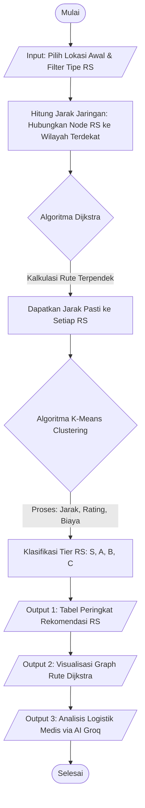

# Laporan Project UAS Struktur Data: HospFinder DSS

**Sistem Pendukung Keputusan Rekomendasi & Navigasi Evakuasi Rumah Sakit di Bali berbasis Graph Database, Algoritma Dijkstra, dan Machine Learning.**

---

**Mata Kuliah :** Struktur Data  
**Semester :** Genap 2025/2026  
**Jenis Tugas :** Project Kelompok    

### Identitas Kelompok  
*Tugas ini dikerjakan oleh :* 
1. **Nama :** I Putu Agus Adi Wiranata | **NIM :** [2501010068] | **Akun GitHub :** [@Wiranz]
2. **Nama :** I Putu Vivekananda Gosvami | **NIM :** [2501010350] | **Akun GitHub :** [@Vivekananda2501]
3. **Nama :** I Gede Arya Desta Adi Wiguna | **NIM :** [2501010083] | **Akun GitHub :** [@Adi4259j]

---

## BAB 1 - Pendahuluan

### 1.1 Latar Belakang

Bali merupakan salah satu destinasi wisata utama sekaligus wilayah dengan mobilitas penduduk yang tinggi. Dalam kondisi darurat medis, pasien atau paramedis seringkali kesulitan menentukan Rumah Sakit (RS) tujuan yang paling optimal. Keputusan tidak hanya bergantung pada jarak terdekat, melainkan juga pada tipe fasilitas medis, kualitas (rating), dan estimasi biaya administrasi.

### 1.2 Rumusan Masalah

1. Bagaimana memodelkan jaringan wilayah dan lokasi Rumah Sakit di Denpasar menggunakan struktur data Graph?
2. Bagaimana menemukan rute evakuasi terpendek dari lokasi pasien menuju Rumah Sakit tujuan menggunakan Algoritma Dijkstra?
3. Bagaimana memberikan rekomendasi/pemeringkatan (Tier) Rumah Sakit secara otomatis dan cerdas?

### 1.3 Tujuan

Merancang dan mengimplementasikan *Decision Support System* (DSS) berbasis *Graph* dan *Machine Learning* untuk memberikan rekomendasi rumah sakit terbaik sekaligus memvisualisasikan rute evakuasi terpendeknya.

### 1.4 Manfaat

Membantu masyarakat umum, turis, maupun paramedis (ambulans) di Bali untuk mengambil keputusan rujukan medis secara cepat, tepat, dan berbasis data (*data-driven*).

---

## BAB 2 - Dasar Teori

### 2.1 Struktur Data Graph

Graph adalah struktur data non-linear yang terdiri dari himpunan simpul (*Node/Vertex*) dan himpunan garis (*Edge*) yang menghubungkan simpul-simpul tersebut. Pada project ini, model graph yang digunakan adalah **Weighted Undirected Graph** (Graph berbobot dan tak berarah), di mana bobot merepresentasikan jarak fisik (dalam kilometer) antar wilayah/kota.

### 2.2 Decision Support System (DSS)

DSS adalah sistem informasi interaktif yang menyediakan informasi, pemodelan, dan manipulasi data untuk membantu pengambilan keputusan pada situasi yang semi-terstruktur.

### 2.3 Algoritma Graph (Dijkstra)

Algoritma Dijkstra digunakan untuk menemukan lintasan terpendek (*shortest path*) dari satu node asal ke node tujuan pada graph berbobot positif. Algoritma ini menggunakan *Priority Queue* (Min-Heap) untuk selalu mengekstraksi jarak minimum pada setiap iterasinya.

---

## BAB 3 - Analisis dan Perancangan

### 3.1 Analisis Masalah & Kesesuaian Graph

**Mengapa Graph cocok digunakan?** Permasalahan pencarian rute rujukan medis melibatkan banyak titik persimpangan kota dan lokasi RS. Graph adalah struktur matematis yang paling natural untuk merepresentasikan topologi jalan (*edge*) dan titik lokasi (*node*).

### 3.2 Desain Graph & Struktur Node/Edge

* **Jenis Graph:** *Weighted Undirected Graph*.
* **Struktur Node:** Merepresentasikan 2 entitas, yaitu Titik Wilayah (misal: Tabanan, Mengwi, Canggu, Denpasar) dan Titik Rumah Sakit (misal: RSUP Sanglah, RS BaliMed).
* **Struktur Edge:** Merepresentasikan jalur yang menghubungkan dua Node beserta atribut `weight` (bobot) yang berisi jarak dalam kilometer.

### 3.3 Flowchart / Alur Sistem

---

## BAB 4 - Implementasi

### 4.1 Teknologi yang Digunakan

* **Bahasa Pemrograman:** Python 3
* **Framework UI:** Streamlit
* **Graph Processing:** NetworkX
* **Machine Learning:** Scikit-Learn (K-Means)
* **Visualisasi:** Matplotlib (Network Plot) & Folium (Web Map)
* **AI Integration:** Groq API (LLaMA-3.1-8B)

### 4.2 Penjelasan Kode Utama

* **`dijkstra(G, start, goal)`**: Implementasi inti struktur data. Menggunakan pustaka `heapq` Python untuk *Priority Queue*. Fungsi ini mengembalikan susunan *path* terpendek, total jarak, dan riwayat langkah komputasi (log).
* **`build_tier(df)`**: Implementasi K-Means dengan *MinMaxScaler*. Membagi RS menjadi beberapa *cluster* berdasarkan metrik kelayakan, lalu memetakan label "Tier S" hingga "Tier C".
* **`render_graph(...)`**: Menggambar representasi matematis Graph ke layar pengguna. Node awal diberi warna Hijau, Node tujuan Merah, dan rute Dijkstra ditandai dengan Edge tebal berwarna Biru/Merah.

### 4.3 Tampilan Sistem

---

## BAB 5 - Pengujian dan Analisis

### 5.1 Skenario Pengujian

* **Skenario:** Pengguna berada di "Tabanan" dan mencari rute menuju "RS Umum Daerah Wangaya" (Tipe B).
* **Hasil:** Sistem berhasil mendeteksi bahwa RS tersebut paling dekat diakses melalui Node "Denpasar". Dijkstra menavigasi rute optimal: `Tabanan → Mengwi → Denpasar → RSUD Wangaya` dengan total jarak akurat. Tabel log komputasi berhasil merekam setiap iterasi *Min-Heap*.

### 5.2 Kompleksitas Algoritma

* **Algoritma Dijkstra:** Kompleksitas waktu adalah **$O((V + E) \log V)$**, di mana $V$ adalah jumlah node (wilayah + RS) dan $E$ adalah jumlah edge (jalan). Penggunaan antrean prioritas (`heapq`) memastikan pencarian sangat cepat (milidetik) meskipun node ditambah.
* **Algoritma K-Means:** Kompleksitas waktunya adalah **$O(I \cdot K \cdot N \cdot D)$** (Iterasi $\times$ Cluster $\times$ Jumlah RS $\times$ Dimensi Fitur). Karena jumlah RS $N \le 24$, komputasi dieksekusi secara instan (real-time).

### 5.3 Kelebihan dan Kekurangan Sistem

* **Kelebihan (Sesuai Syarat Bonus Nilai):**
* Menerapkan **AI Recommendation** (LLaMA 3.1) untuk menarasikan alasan pemilihan medis.
* Menerapkan **Machine Learning** (K-Means) otomatis tanpa *if-else* kaku.
* Memiliki **Multi-user system / Role-based** (Admin vs Guest).
* Terdapat integrasi **API Eksternal** (Groq AI & Google Maps Embed).
* **Visualisasi Interaktif** yang responsif (Matplotlib SVG & Peta Interaktif).

* **Kekurangan:**
* Topologi graf (*Base Nodes & Edges*) masih bersifat statis (direpresentasikan secara manual dalam *array*), belum terhubung langsung dengan *traffic* jalan raya secara *real-time* (seperti Google Maps Distance Matrix API).

---

## BAB 6 - Kesimpulan

### 6.1 Kesimpulan

Penerapan struktur data Graph terbukti bukan sekadar teori, melainkan fondasi vital dalam membangun *Decision Support System* berskala nyata. Integrasi algoritma Dijkstra untuk pencarian rute dan K-Means untuk klasifikasi multikriteria berhasil menciptakan sistem yang merekomendasikan layanan kesehatan di Denpasar secara presisi dan komprehensif.

### 6.2 Saran Pengembangan

Untuk pengembangan di masa depan, sistem dapat diubah menjadi *Dynamic Graph* di mana bobot *edge* berubah secara *real-time* berdasarkan data kemacetan lalu lintas, dan menambahkan analisis *Centrality* untuk menentukan wilayah mana di Bali yang paling krusial untuk dibangun Rumah Sakit baru.
